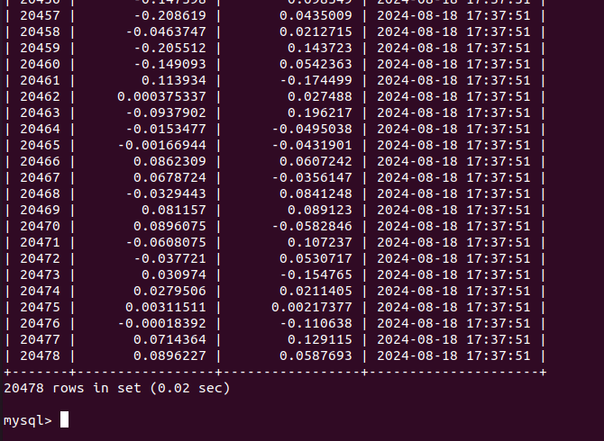

📡 RF Monitoring System
GNU Radio와 Python을 활용해 SDR 수신 신호의 I/Q 샘플을 수집하고,  
이를 dBm 단위의 수신 전력 값으로 변환하여 지도 기반 Drive Monitoring 화면에 시각화한 프로젝트입니다.
본 프로젝트는 통신 내용 복호화가 아닌,  
비식별 RF 신호 세기 변화를 모니터링하는 것을 목적으로 구현했습니다.
---
📌 프로젝트 개요
본 프로젝트는 SDR 수신 신호를 기반으로 RF 전파 세기를 모니터링하기 위한 코드 모음입니다.  
GNU Radio에서 수신한 I/Q 데이터를 MySQL DB에 저장하고, Python 스크립트를 통해 magnitude 및 dBm 값을 계산했습니다.  
최종적으로 계산된 RF 수신 전력 데이터를 지도 위에 표시하여 측정 경로별 신호 변화를 확인할 수 있도록 구성했습니다.
---
🧩 시스템 구성
```text
SDR Receiver
    ↓
GNU Radio Flowgraph
    ↓
I/Q Sample Collection
    ↓
MySQL Database Storage
    ↓
Python dBm Conversion
    ↓
Drive Monitoring Visualization
```
---
🗂️ 코드 구성
File	Description
`est.grc`	FM 방송 신호 복조 및 QT GUI 기반 시각화 테스트
`rf_monitoring.grc`	SDR 수신 I/Q 샘플을 MySQL DB로 저장하는 GNU Radio flowgraph
`scale.py`	DB에 저장된 I/Q 데이터를 기반으로 magnitude 계산 후 dBm 단위 수신 전력 값으로 변환
> 기존 파일명 `skt_downlink.grc`는 포트폴리오에서는 `rf_monitoring.grc`처럼 일반화된 이름으로 표기하는 것을 권장합니다.
---
🔧 주요 기능
GNU Radio 기반 SDR 수신 신호 처리
I/Q 샘플 실시간 수집
MySQL DB 기반 측정 데이터 저장
Python을 활용한 magnitude 계산
dBm 단위 수신 전력 값 변환
지도 기반 Drive Monitoring 시각화
RSRP / RSRQ 지표 선택형 모니터링 UI 구현
---
📊 데이터 처리 과정
1. I/Q 데이터 저장
GNU Radio flowgraph를 통해 수신한 I/Q 샘플을 DB에 저장했습니다.  
각 샘플은 시간 정보와 함께 저장되어 이후 수신 전력 계산에 활용됩니다.

---
2. dBm 변환 결과
저장된 I/Q 데이터를 Python에서 불러온 뒤, magnitude를 계산하고 dBm 단위의 수신 전력 값으로 변환했습니다.
.png)
---
3. Drive Monitoring 시각화
변환된 수신 전력 데이터를 지도 위에 표시하여 측정 경로별 RF 신호 변화를 확인할 수 있도록 구현했습니다.  
사용자는 RSRP, RSRQ 버튼을 통해 원하는 지표를 선택적으로 확인할 수 있습니다.
.png)
---
🛠️ 기술 스택
<p>
  
  
  
  
</p>
---
📡 주요 기술
기술	적용 내용
GNU Radio	SDR 수신 신호 처리 및 I/Q 샘플 수집
MySQL	I/Q 데이터 및 dBm 변환 결과 저장
Python	I/Q magnitude 계산 및 dBm 단위 변환
Leaflet Map	위치 기반 RF 측정 결과 시각화
QT GUI	수신 신호 복조 및 시각화 테스트
---
📈 결과
본 프로젝트를 통해 SDR 기반 수신 신호를 DB에 저장하고,  
Python 기반 후처리를 통해 dBm 단위의 RF 수신 전력 값으로 변환했습니다.  
또한 지도 기반 Drive Monitoring 화면을 구현하여 측정 경로에 따른 신호 세기 변화를 직관적으로 확인할 수 있도록 했습니다.
---
⚠️ Note
본 프로젝트는 통신 내용, 사용자 데이터, 패킷, 음성, 문자, 가입자 식별정보를 복호화하거나 분석하지 않습니다.  
SDR 수신 신호의 I/Q 샘플을 기반으로 비식별 RF 수신 전력 크기 변화를 모니터링하는 목적으로 구현했습니다.
---
