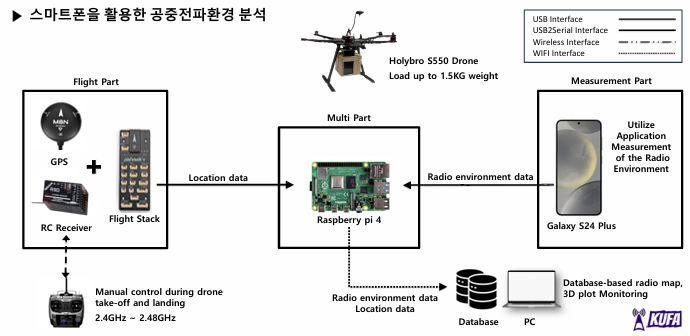
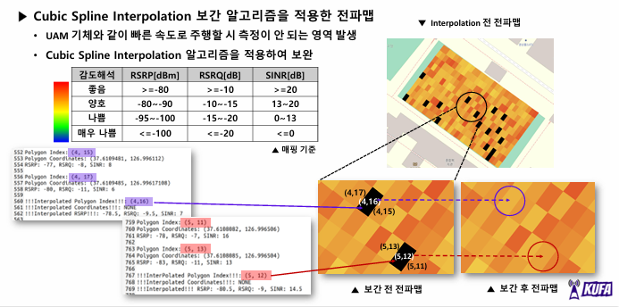
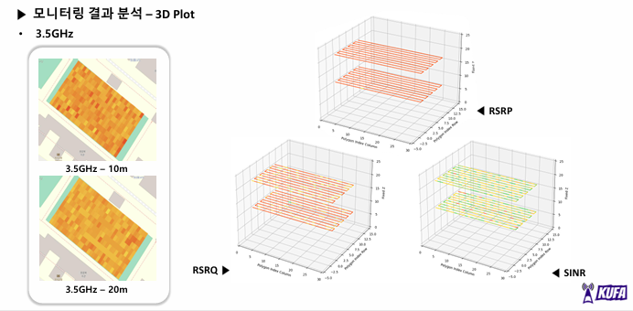

# 🚁 UAM 공중회랑 전파환경 모니터링 시스템 🚁

> 2024 전국 대학생 UAM 올림피아드 전파환경분석 부문 출품작  
> 드론 기반 상용 이동통신망 전파환경 측정·저장·시각화 시스템

---

## 📌 1. 프로젝트 개요

UAM 도심항공교통 운용을 위해 공중 회랑 내 LTE/5G 전파환경을 측정하고 분석한 프로젝트입니다.  
스마트폰과 Raspberry Pi를 드론에 탑재하여 GPS 위치 데이터와 RF 측정값을 실시간으로 연계 저장하고,  
지상 관제 PC에서 전파맵과 3D Plot으로 시각화했습니다.

### 🧩 핵심 기능

- LTE/5G 상용망 기반 RF 지표 수집
- GPS 위치 정보와 측정 데이터 동기화
- Raspberry Pi 기반 실시간 DB 저장
- Python 기반 전파맵 및 3D Plot 시각화
- 고도별·주파수 대역별 전파환경 비교 분석

---

## 🖥️ 2. 시스템 구성

| 구분 | 구성 요소 | 역할 |
|---|---|---|
| 측정 | Galaxy S24+ | Android 앱 기반 RSRP, RSRQ, SINR 수집 |
| 중계 | Raspberry Pi 4 | GPS/RF 데이터 저장 및 전송 |
| 비행 | Holybro S550 Drone | 측정 장비 탑재 및 공중 회랑 비행 |
| 시각화 | PC | Python 기반 전파맵 및 3D Plot 생성 |

---

## 📡 3. 측정 항목

| 지표 | 의미 | 단위 |
|---|---|---|
| RSRP | 수신 신호 전력 | dBm |
| RSRQ | 수신 신호 품질 | dB |
| SINR | 신호 대 간섭·잡음비 | dB |

### 측정 주파수 대역

| 구분 | 대역 |
|---|---|
| LTE Band 5 | 800~900 MHz |
| LTE Band 7 | 2.6 GHz |
| 5G Band 48 | 3.5 GHz |

---

## 📍 4. 주요 기술

| 기술 | 적용 내용 |
|---|---|
| Android TelephonyManager API | 스마트폰 기반 상용망 RF 지표 수집 |
| RS-232 Serial Interface | 스마트폰·Raspberry Pi 간 측정 데이터 전달 |
| MySQL | GPS 위치 정보와 RF 측정값 동시 저장 |
| Cubic Spline Interpolation | 드론 이동 중 발생한 측정 누락 구간 보간 |
| Python / Jupyter | 전파맵 및 3D Plot 시각화 |

---

## ✅ 5. 측정 및 분석 결과

주파수 대역별, 고도별 전파환경 차이를 비교 분석했습니다.  
특히 800 MHz, 2.6 GHz, 3.5 GHz 대역에서의 수신 전력 및 품질 변화를 확인하고,  
10 m와 20 m 고도 조건에서의 전파 특성 차이를 시각화했습니다.

### Radio Map

### 3D Visualization

  
  
  

---

## ⚙️ 6. 기술 스택

  
  
  
  
  
  

---

## 🏆 7. 성과

- 2024 전국 대학생 UAM 올림피아드 전파환경분석 부문 장려상 수상
- 드론 기반 LTE/5G 전파환경 측정 시스템 구현
- GPS-RF 데이터 연계 저장 및 3D 시각화 파이프라인 구축
- 프로젝트 연구 결과 KCI 등재 논문 게재

📄 **Publication**  
[UAM 공중회랑 전파환경 분석 관련 KCI 논문 바로가기](https://www.kci.go.kr/kciportal/ci/sereArticleSearch/ciSereArtiView.kci?sereArticleSearchBean.artiId=ART003221567)
