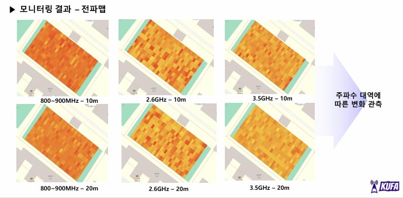
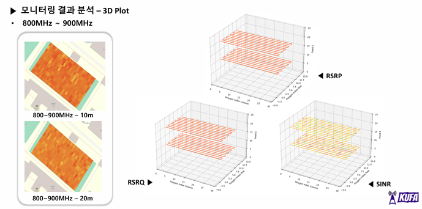

UAM 공중회랑 전파환경 모니터링 시스템
> 2024 전국 대학생 UAM 올림피아드 전파환경분석 부문 출품작
<!-- 프로젝트 대표 이미지 -->

---
📌 프로젝트 개요
UAM(도심항공교통) 운용을 위한 공중 회랑에서의 상용 이동통신망 전파환경 분석 시스템을 설계·구현함.  
스마트폰과 Raspberry Pi를 드론에 탑재해 GPS 위치 데이터와 RF 측정값을 실시간으로 연계 저장하고,  
지상 관제 시스템에서 전파맵 및 3D Plot으로 시각화함.
---
🛠 시스템 구성
<!-- 하드웨어 구성 이미지 -->

파트	구성 요소
측정	Galaxy S24+ (Android 앱, RSRP/RSRQ/SINR 수집)
중계	Raspberry Pi 4 (MySQL DB 저장, RS232 Serial Interface)
비행	Holybro S550 드론 (탑재 중량 최대 1.5kg)
시각화	PC (Python, Jupyter — 전파맵 / 3D Plot)
---
📡 측정 파라미터
지표	설명	좋음	양호	나쁨	매우 나쁨
RSRP	신호 전력 (dBm)	≥ -80	-80 ~ -90	-95 ~ -100	≤ -100
RSRQ	신호 품질 (dB)	≥ -10	-10 ~ -15	-15 ~ -20	≤ -20
SINR	신호 대 간섭·잡음비 (dB)	≥ 20	13 ~ 20	0 ~ 13	≤ 0
측정 주파수 대역
LTE Band5 (800~900 MHz)
LTE Band7 (2.6 GHz)
5G Band48 (3.5 GHz)
---
🔧 주요 기술
Android TelephonyManager API  
실제 핸드오버를 반영한 상용망 측정 — 스펙트럼 분석기 없이 실측 가능
Cubic Spline Interpolation  
드론 이동 중 측정 누락 영역을 3차 다항식 보간으로 보완
실시간 DB 저장  
GPS(위도·경도·고도) + RF 측정값 동시 저장 → Ground Station 전송
<!-- 보간 전후 비교 이미지 -->

---
📊 측정 결과
<!-- 전파맵 이미지 -->

<!-- 3D Plot 이미지 -->

주파수 대역별(800MHz / 2.6GHz / 3.5GHz) 전파환경 특성 차이 실측
고도별(10m / 20m) 신호 품질 변화 비교 분석
---
💻 기술 스택

---
🏆 성과
2024 전국 대학생 UAM 올림피아드 본선 진출
